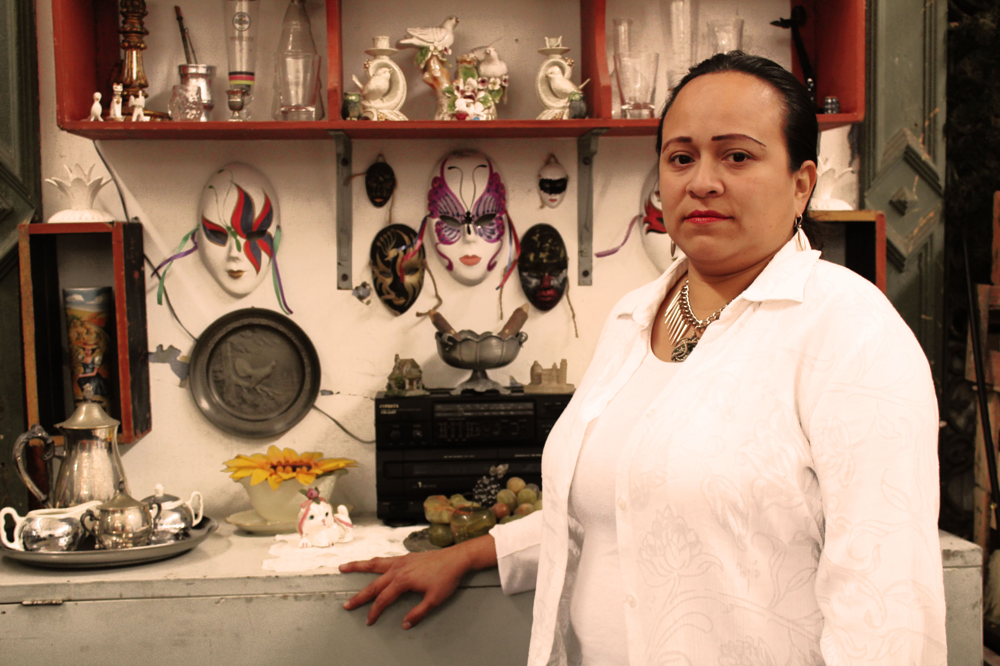

# 
 E-commerce: Thopaka Arts & Crafts 

## 1. Introducción
Las empresas en la actualidad se encuentran en un constante proceso de evolución para lograr avanzar en la carrera tecnológica de digitalización que exige el mercado. Dadas las nuevas tendencias y herramientas de compra y venta en línea, tanto los antiguos como nuevos negocios de empresarios y emprendedores particulares, deben sumergirse en esta ola de transformación que beneficia en ambos sentidos las técnicas mercantiles.

### 1.1. Análisis del contexto
Una gran cantidad de pequeños negocios latinoamericanos han recurrido a plataformas en línea preexistentes como:

#### Redes Sociales:
- Fanpages de Facebook
- Cuentas de empresa de Instagram
- Cuentas de Twitter, etc.

#### Online Marketplaces:
- Mercado Libre
- Linio
- Olx, etc.

Para poder agilizar la compra y venta de sus productos, minimizando costos en publicidad, llegando más rápida y eficientemente al cliente final, generando sus propias tiendas online sin la necesidad de pasar por el registro burocrático en las instituciones de control de comercio de sus respectivos países y lo más importante: darle una personalidad exclusiva a su marca, la cual puede interactuar en tiempo real con sus clientes frecuentes y potenciales a través de las funcionalidades que la plataforma le brinde como likes, comentarios, shares, publicaciones de pago por publicidad, generación de contenido exclusivo y edición del mismo. Todo esto ha permitido surgir a una enorme cantidad de pequeñas y microcompañías para establecerce en el mercado de forma oportuna, incitando cada vez más el florecimiento de nuevos emprendimientos en distintos ámbitos de la industria.

Uno de esos ámbitos bastante explotado y solicitado por los consumidores es el artístico, ya que creadores de todo tipo de productos, exponen sus invenciones en base a sus destrezas en estas mismas plataformas para ser vendidas a un público particular. Del mismo modo, hay coleccionistas, subastadores, consignatarios y mercaderes de todo tipo de venta de arte, que usan estas alternativas en línea para estimular sus transacciones. 

### 1.2. Objetivos del proyecto
Nosotras nos enfocaremos específicamente en el sector de artesanías y antigüedades, ya que transformaremos digitalmente a Thopaka, una microempresa peruana ubicada en el distrito de Barranco en la ciudad de Lima. 

#### ¿Qué es Thopaka?
Thopaka es un pequeño negocio dedicado a la producción y venta de artesanías, así como también la compra local y extranjera de antigüedades para ser ofrecidas al público. Han pasado 11 años desde que se fundó y aunque no han sido continuos, Thopaka, administrada por su dueña, Patricia (cliente autorizó la utilización de este nombre), sigue en pie. Durante este período de tiempo ha diversificado los [productos ofrecidos a sus usuarios](https://drive.google.com/open?id=151mUoaa_cVmiVM84jUFhfrW1_xxp_-_m), haciéndolos cada vez más personalizados y únicos, dándole este detalle un potencial despegue de marca y fidelización de sus clientes con la marca.
#### 
 Taller de producción de artesanías de Thopaka 

Como equipo nos propusimos una serie de objetivos que detallaremos a continuación:

#### Objetivo General:
Transformar los procesos de gestión comercial de Thopaka digitalmente, elaborando un proyecto web que le permita a la administración tener su propio sitio en internet, donde puedan ser encontrados por sus clientes para la adquisición de los artículos que ofrecen.

#### Objetivos Específicos:
- Crear una galería en el website que permita exponer los productos que Thopaka tiene en stock.
- Estandarizar la exposición de la mercadería ofrecida en la galería.
- Implementar un sistema de pago digital para agilizar el proceso de venta.

Y en una versión futura podría también:

- Permitirle al cliente modificar esta galería agregando nuevos artículos a la venta y marcar los ya vendidos.
- Implementar opciones de interacción con clientes como comentarios y puntuaciones.

## 2. Problema e industria
En el Perú, el sector artesanal y de comercio de antigüedades ha estado olvidado en los últimos años; sin embargo, cuenta con un elevado potencial de crecimiento. Existe mano de obra calificada no empleada, donde la inversión para una reactivación inicial no es necesariamente elevada y que fundamentalmente se concentra en la actividad de microcomercialización en nichos específicos del mercado.

Sobre esta base, decidimos encontrar la manera de hacer más productivo a nuestro cliente ubicado dentro del sector artesanal. Para ello, analizamos las estrategias empleadas por Thopaka para penetrar en el negocio donde ahora se desenvuelve y que presenta potenciales oportunidades de crecimiento y desarrollo a largo plazo dentro del mundo digital.

### 2.1. Definición del problema
Thopaka como microempresa cuenta con una serie de limitantes que impiden su expansión en el sector al cual se dedica. Y esas son principalmente el acceso a información de sus productos por parte de los usuarios para un proceso de compra más ágil, rápido y eficiente. Veamos por ejemplo el manejo de contenido que realizan sus actuales plataformas gitiales:
#### Thopaka en la web:
- [Fanpage](https://www.facebook.com/THOPAKA.Curiosidadesdealemaniadelperuydelmundo/) 
- [Instagram](https://www.instagram.com/thopaka/)
- [Twitter](https://twitter.com/Thopaka)

Podemos verificar que dentro de las [redes sociales donde opera Thopaka](https://drive.google.com/open?id=1JBYCGaw1UCdpkyqX_CTT1Vs0MiMhXCN_) cuenta con información bastante dispersa, combinando información de entretenimiento, noticias, posts de productos, entre otros en una misma vista y sin planificación temporal. Es por esto que el proyecto E-commerce del negocio que planteamos, espera estandarizar la edición de sus contenidos, clasificarlos y plasmarlos debidamente a sus clientes, de modo que la relación vendedor-consumidor se vea beneficiada por la mejora en sus procesos de compra.

### 2.2. Estudio de la industria
De acuerdo a estudios de [MINCETUR](https://www.mincetur.gob.pe/turismo/lineas-de-intervencion/desarrollo-de-la-artesania/), el Perú tiene una cultura tradicional en artesanía, reflejada en hermosas manifestaciones que se muestran a través de los productos pertenecientes a diversas líneas, como cerámica, textilería, peletería, imaginería, arpillería, mates burilados, retablos, etc. La artesanía peruana constituye un sector muy particular dentro de la pequeña o la microempresa, ya que en él existen subsectores productivos muy diferenciados, cada uno de
ellos con una problemática específica. Sin embargo, el rubro artesanal ha sido tratado como un todo, sin pensar en todas las diferencias que se pueden presentar en él.

El sector artesanal cuenta con una gran variedad de talleres dedicados a diferentes líneas de producción a lo largo del territorio nacional, pero no hay un estudio definitivo hecho por algún organismo –público o privado– que indique, con mayor precisión, la situación actual de este rubro. Es por esto que es muy difícil establecer la situación de mercado en la que se encuentra Thopaka.

### 2.3. Aplicación al entorno
La artesanía en la forma de negocio que ofrece Thopaka, como actividad productiva en nuestro país, posee características definidas, desarrollándose en forma espontánea y empírica, con bajos montos de inversión, uso de tecnologías tradicionales, predominio de habilidad manual y basada en la capacidad creativa de Patricia como artesana. Esta situación negocio en cuestión en desventaja en relación con otras actividades económicas y plantea un problema de urgente solución.

Repotenciar los procesos comerciales que posee actualmente, implicando demostrar que su producción es constante y entrega al público artículos de calidad, en el tiempo y momento justos.

## 3. Plan presupuestal

[Plan presupuestal y su sustento](https://drive.google.com/open?id=1S4F8It7Uc2LNeuhokwBMLDnlW0YMlPMK)

## 4. Entrevistas

### 4.1. Entrevista con cliente
La [entrevista al cliente](https://drive.google.com/drive/folders/1HCTeSe2FfroejShsqOedDdsxPIwKT2hN) se realizó el 17 de agosto del año 2018 a las 16 horas en las instalaciones de su taller de fabricación y almacén de productos, ubicado en el distrito de Barranco de la ciudad de Lima. La entrevista tuvo un ambiente amigable y obtuvimos mucha información durante la conversación.

#### 4.1.1. Guía de preguntas planteadas
1. ¿Cuándo nació Thopaka? 
2. ¿Qué es Thopaka? ¿cuál es su actividad como empresa? 
3. ¿Cómo obtienes los productos para Thopaka?
4. ¿Cómo describirías a Thopaka en 3 palabras?
5. Cuéntame cómo empezaste a trabajar con Thopaka.
6. ¿Cómo opera Thopaka ahora?
7. ¿Cuáles son los objetivos de tu empresa a corto plazo? ¿A mediano plazo? ¿A largo plazo?
8. ¿Qué es lo más importante para ti de Thopaka? ¿Cuál es su esencia?
9. ¿Qué redes sociales o páginas usas para difundir Thopaka?
10. ¿Por qué usas Facebook?
11. ¿Qué ventajas te brinda Facebook para tu negocio?
12. ¿Cómo utilizas las redes sociales para tu beneficio?
13. ¿Qué tan frecuente tus compradores te contactan por facebook u otra red social?
14. Cuéntame sobre la última vez que te compraron algún producto. ¿Qué te compraron? ¿Dónde? 
15. ¿Cómo es el proceso en caso te algún producto por internet? 
16. Descríbeme el proceso de delivery en Thopaka
17. ¿Qué es lo que te gustaría que las personas noten más de Thopaka?
18. ¿Con qué  medios de pago trabajas? ¿Por qué? 
19. ¿Te gustaría trabajar con tarjetas de débito o crédito en tu página?
20. ¿Tienes alguna referencia sobre una tienda virtual que te gustaría sugerirnos?

#### 4.1.2. Conclusiones de entrevista con cliente

Thopaka es una empresa que tiene un valor agregado, no solo se trata de vender antigüedades y artesanías, sino también de personalizar sus productos. Entonces recibe pedidos y elabora artesanías de acuerdo a los gustos del cliente.

Realiza importaciones alemanas, pero tiene la dificultad de entrada en aduanas, ya que muchas veces los aduaneros no tienen ningún tipo de cuidado con los productos y pueden llegar a romperlos al tirarlos. Esta situación, obviamente, crea un tipo de pérdida para la empresa.

Ya que Thopaka ofrece garantía, se caracteriza por ofrecer precios de acuerdo al estado en el que se encuentra su producto. Además, ofrece artesanías de muy buena calidad, porque para su fundadora, es muy importante darle a sus clientes algo que perdure. Y también, recicla todo lo que se pueda.

La empresa no tiene una tienda física aún. Va a ferias o la contactan por redes sociales. Las que más usa son Facebook e Instagram. Y tampoco ha tenido un tiempo de funcionamiento continuo, sino que ha tenido varios momentos en los que ha dejado el negocio.

En su página de Facebook promociona las ferias a las que va para que sus seguidores sepan que estará allí. 
El tema de delivery es complicado para Thopaka por el valor que tienen muchos de sus productos. La dueña tiene el temor de ser estafada o que le roben. Asimismo, no publica todos sus productos por ese mismo temor. Por esa razón, maneja la mayoría de sus contactos por Whatsapp, pero muchas veces duda de realizar la venta cuando la contactan por internet.

La dueña de Thopaka ya ha utilizado el POS de Visa, pero lo considera un pésimo servicio, así que lo dejó de usar. Pero sí utilizaría una cuenta bancaria para los pagos de sus clientes.

Lo más importante para Thopaka es la satisfacción de sus clientes.

#### 4.1.3. Customer Journey Map
El [mapa de viaje del cliente (Customer Journey Map)](https://drive.google.com/file/d/13FOl_KDIWDFCl5Vc2qp0UY1caXBSsjKU) fue diseñado en base a las experiencias de los usuarios narradas por el cliente, dado que obtener información fidedigna de clientes reales es un proceso complicado dada la naturaleza del negocio, en la cual sus usuarios frecuentes concurren a comprar en ferias de artesanías y antigüedades donde Thopaka participa, es por este motivo que se hizo el análisis en base a la atención que nuestra cliente ha realizado a clientes contactados desde su [fanpage en facebook](https://www.facebook.com/THOPAKA.Curiosidadesdealemaniadelperuydelmundo/) donde le hicieron una cotización y concretaron una venta a contra-entrega:

### 4.2. Entrevistas con usuarios
Las [entrevistas con los usuarios](https://drive.google.com/drive/folders/1-fzbEuVjN6tGWHYnVgsfTEN1DI3mb-RR) se dieron el 18 de agosto del año 2018 entre las 13 y las 16 horas en el distrito de San Borja. Se dio dentro de las instalaciones de un local comercial que vende diversos tipos de artículos que incluyen el sector al cual nos estamos avocando. Los entrevistados son clientes no conocidos nuestros, pero concurrentes al local mencionado. Este proceso contó con la participación de los dos miembros del equipo creador de este proyecto, se pidió autorización previa a los entrevistados para ser grabados en audio y se les informó que la entrevista no sería muy extensa para su mayor predisposición a ayudar en este estudio.

#### 4.2.1. Guía de preguntas planteadas
1. ¿Cuál es su nombre? 
2. ¿Cuál es su edad? 
3. ¿En qué distrito vive?
4. ¿Alguna vez ha comprado artesanías?
5. ¿Qué tipo de artesanías a comprado? ¿Dónde? ¿Cuándo?
6. ¿Alguna vez ha comprado antigüedades?
7. ¿Qué tipo de antigüedades a comprado? ¿Dónde? ¿Cuándo?
8. ¿Con qué frecuencia realiza estas compras?
9. ¿Alguna vez ha comprado por internet?
10. ¿Cómo fue esta experiencia? ¿Qué? ¿Cómo? ¿Cuándo? ¿Dónde?

#### 4.2.2. Conclusiones de las entrevistas a usuarios

Pudimos entrevistar a 4 mujeres y 1 hombre, que provienen de diversos distritos de Lima. Una de ellas tiene 20 años y los demás entrevistados tienen entre 29 y 40 años. Todos han comprado artesanías anteriormente. Algunos compraron en la ciudad de Cusco o en la selva cuando viajaron. 3 nunca han comprado antigüedades y 2 sí lo han hecho alguna vez. De los tres que no lo hicieron, 1 expresó que sí es posible que lo haga en un futuro.

El hombre entrevistado compra artesanías una vez al mes o más dependiendo de la ocasión. La mujer de 20 años hizo su última compra en el 2014. Las demás entrevistadas compran entre dos veces al año y más regularmente. Una de ellas recibe invitaciones a exposiciones de artesanías y antigüedades y compra si le gusta algo.

Las principales razones por las que compran artesanías o antigüedades son por gusto personal, para regalar a familiares y para decorar. Entre los productos que han adquirido se encuentran huacas, cabezas clavas pequeñas, artesanías de la selva, collares, aretes, ligas, vestimentas, chompas, llaveros, chullos, cuadros, pinturas renacentistas.

3 de los entrevistados nunca han comprado por internet pero sí les gustaría hacerlo. Y de los 2 que sí han comprado, 1 expresó su temor inicial, pero la experiencia resultó ser muy buena.

La principal razón por la que los usuarios no han comprado por internet anteriormente es porque desconfían de ello. Tienen la preconcepción de que es complicado, de que puede haber problemas, que no llegue lo que compran o que no sea el artículo exacto o incluso que los estafen. Pero sí les gustaría hacerlo porque les resultaría un método más rápido, y además tienen amistades que lo han hecho antes y les ha ido bien.

#### 4.2.3. Definición del público objetivo
Después de la entrevista con la cliente, observamos que, debido a la gran variedad de productos que ofrece Thopaka, el público objetivo es distinto dependiendo del tipo de producto. Para antigüedades, el público objetivo es hombres y mujeres profesionales de 40 años a más. Y para manualidades y artesanía personalizada, el público objetivo es mujeres mayores de 28 años.

#### 4.2.4. User persona

Pudimos obtener las siguientes user personas:

## 5. Inventario de contenidos
De acuerdo a las actuales posibilidades de interacción que Thopaka ofrece a sus usuarios en redes sociales y también considerando el análisis de respuesta del cliente y los usuarios, vemos necesario considerar el siguiente contenido para la elaboración del proyecto web:
* Home
* Nombre de la empresa
* Buscador
* Lista de productos seleccionados
* Menú hamburguesa
* Categorías de productos
* Antigüedades
* Artesanías
* Contáctanos
* Historia de la empresa
* Foto del producto
* Título del producto
* Precio del producto
* Descripción del producto
* Historia del producto

## 6. Árbol de contenidos

## 7. Solución y prototyping

### 7.1. Definición de la solución

La solución se planteó tomando en cuenta los problemas de confianza del usuario y considerando todas las necesidades del negocio para su inmersión en el mundo digital. Por eso decidí optar por un diseño sencillo y minimalista, manteniendo la gama de colores de Thopaka y mostrando productos principales y precios desde un principio. Además, en el menú se encuentra una sección donde está la historia e información del negocio donde se puede contactar a la empresa para tener un trato más personal. Así también, se implementó un buscador para facilitarle al usuario encontrar el contenido que requiere. 

### 7.2. Sketch

Inicialmente se ideó el siguiente sketch para las primeras vistas:

Luego de analizar mejor la investigación e iterar, se realizaron nuevos sketches:

[Link a los demás sketches](https://drive.google.com/open?id=1ijNYLeKdzDORyoH9rOdUVkRzzMeEJxaA)

### 7.3. Wireframe
En base al sketch inicial se planteó el siguiente wireframe:

Después de la actualización, y de un pequeño testing del wireframe con dos personas, esto es lo que resultó de las primeras vistas:

[Ver más de este último wireframe](https://drive.google.com/open?id=1JcQK8ABYMmxa0D6M3kzWE7SM0xXzLAst)

Si miramos la [segunda versión del wireframe](https://drive.google.com/open?id=1mt8aga-CGK3GmHL664kKvRh0wncnU23N), la diferencia con la última versión es la flecha hacia la izquierda en la parte inferior de la vista. En el testing que hice, los usuarios nunca usaron esa flecha, la ignoraron completamente. Por lo que me dieron a entender que no era necesaria implementarla.

### 7.4. Prototipo de alta fidelidad

[Link al prototipo de alta fidelidad](https://xd.adobe.com/view/95146c5d-2587-4881-6ee8-9ec03cfb234e-e325/)

### 7.5. Testing del prototipo de alta fidelidad

En el primer testing del prototipo obtuve las siguientes conclusiones con dos usuarios de 25 y 26 años:

- Los usuarios lo encontraron bastante intuitivo de usar.
- Les gustó la simplicidad y el color.
- Una no entendió las flechas que se encuentran dentro de la imagen/foto del producto, pero por su respuesta y reacción, concluí que era debido a la foto que usé ya que es muy parecida a la primera, más que por confusión funcional. 
- Como mencioné anteriormente, los usuarios no utilizaron la flecha inferior de la página en el wireframe, pero quise testearlo también en el prototipo de alta fidelidad para ver si había algún cambio en cuanto a su uso. Obtuve los mismos resultados, nadie la utilizó, así que la borré porque no es necesaria. 

En el segundo testing del prototipo, capté a 5 personas entre los 28 y 55 años, y con ellos saqué las siguientes conclusiones:

- Todos los usuarios estaban en contra o se mostraban reacios a tener que registrarse para realizar la compra o tener que iniciar sesión.
- ALgunos tuvieron dificultad de completar la compra cuando el proceso llegaba a la parte de ingresar o registrarse.
- La mayoría prefiere ir a la misma tienda a ver los productos porque son antigüedades y cosas que prefieren ver, tocar, conversar con la persona que los vende.
- Los usuarios respondieron bien en general al aplicativo pero como un medio que los conecta con la empresa para poder acudir personalmente.
- A todos les gusta leer una pequeña historia del producto.
- Los usuarios de mayor edad tuvieron dificultad en regresar a la página principal cuando estaban en otra vista. La principal razón fue porque no encontraban el botón usual para regresar de un dispositivo que utiliza sistema Android.

[Fotos y videos de testing](https://drive.google.com/open?id=1lE44c0N5beIvuvRsee541C0yO9RagaaY)

Por estas razones, decidí replantear mi solución y quitar el login y registro de usuarios. Así como también, convertir la página de Thopaka en un medio para ver los productos que tienen, poder reservar una compra y luego contactarse y ver la información de la empresa para poder acudir a ella o comunicarse para plantear un posible delivery, si el usuario lo requiere.

## 8. Definición del producto

### 10.5. Contenido que el usuario quiere ver
(Información que buscarían para convencerse de comprar, confiar en el negocio, encontrar lo que busca y comprarlo)
### 10.6. Distribución y entrega de contenidos
### 10.7. Flujo de usuarios
(Para que acaben comprando deberán hacer en la web)

### 11. Zeplin

## 13. Conclusiones generales
Con la aplicación de las estrategias digitales propuestas se logrará que Thopaka pertenezca al sector artesanal competitivo, rentable, y sostenible en un mercado globalizado; permitiendo que la actividad que realiza sea una fuente generadora de rentabilidad y liquidez para la reinversión que necesita.

La propuesta planteada para la reformulación tecnológica comprende la integración de los factores claves, la identificación de los actores, sus roles, y la influencia de estos sobre los factores claves, así como la relación existente entre ellos. 

Todos estos actores, en un trabajo coordinado e integrado dirigido hacia objetivos comunes, darán como resultado una mejor utilización de los recursos tanto físicos como virtuales, la solución de problemas con los usuarios, y un desarrollo sostenible de largo plazo en el sector artesanal y de comercio de antigüedades.

La influencia de los actores sobre los factores claves nos permitió identificar las necesidades y capacidades de desarrollo de Thopaka, así como nos permitió definir a los siguientes factores como los principales: mantenimiento de una producción constante para la actualización de su galería de productos, promoción de la unidad productiva artesanal con la adecuada y temprana exposición al público, creación de diseños propios para la marca, comunicación de información sobre cada artículo personalizado en la misma página, mantenimiento constante de estándares de calidad y permanente innovación tecnológica.

<!-- ## 14. Equipo de trabajo
* [María Elena Zúñiga](https://github.com/malenazp/lim-2018-01-ux-marketplace)
* [Doda Maticorena](https://github.com/DodaMaticorena/lim-2018-01-ux-marketplace) -->

Visualiza todos los archivos del proyecto [aquí](https://drive.google.com/open?id=1y33trGkV-iU1jCG9kB__BxxHjcjWD0AY).

